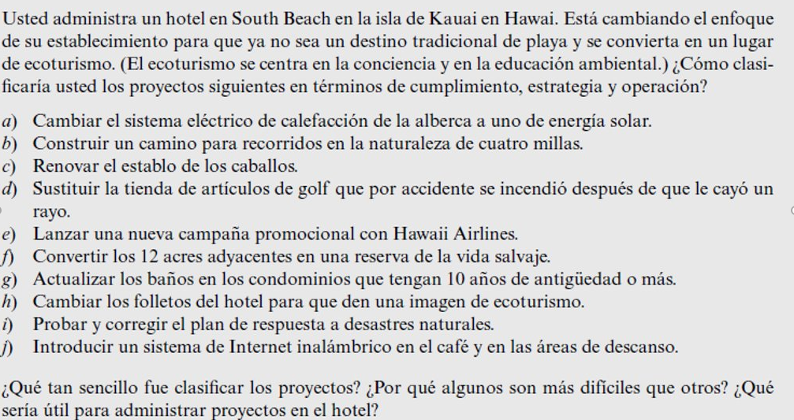

    <h1 align="center">Ejercicio 1</h1>

# Respuesta

<ol type="a">
  <li>Proyecto Estratégico</li>
  <li>Proyecto Operativo</li>
  <li>Proyecto Estratégico/Proyecto Operativo</li>
  <li>Proyecto de Cumplimiento</li>
  <li>Proyecto Operativo</li>
  <li>Proyecto Estratégico</li>
  <li>Proyecto de Cumplimiento</li>
  <li>Proyecto Estratégico</li>
  <li>Proyecto Operativo</li>
  <li>Proyecto Estratégico</li>
</ol>
